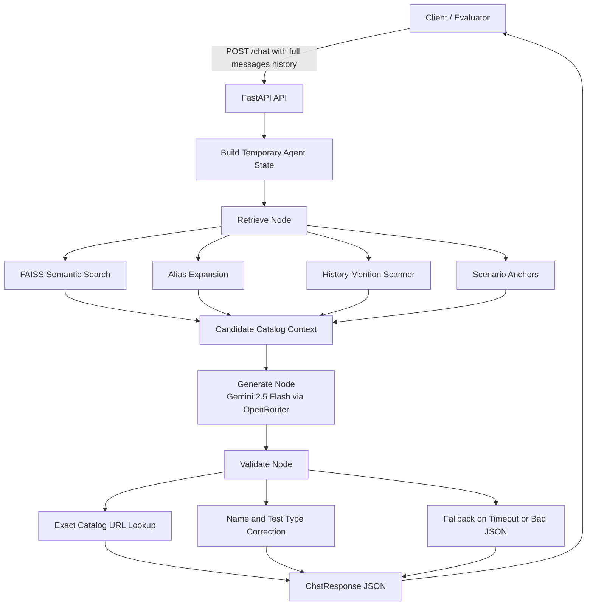
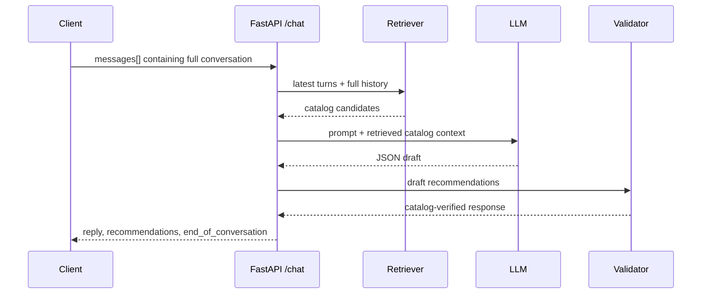

# SHL Assessment Recommender

A stateless FastAPI service that recommends SHL Individual Test assessments through a conversational API. The system uses the provided SHL catalog, semantic retrieval, an LLM reasoning step, and deterministic validation to return grounded recommendations with catalog-only URLs.

## Assignment Coverage

- Uses the provided SHL product catalog.
- Exposes `GET /health` and `POST /chat`.
- Accepts full stateless conversation history on every `/chat` request.
- Clarifies vague requests before recommending.
- Recommends 1-10 assessments with official catalog names, URLs, and test types.
- Supports refinement and comparison across turns.
- Refuses off-topic, legal, general HR, and prompt-injection requests.
- Validates every recommendation against the local catalog.

## Architecture



The service is stateless. It reconstructs temporary state from the incoming `messages` array and discards it after returning the response.



## API

### Health

```http
GET /health
```

Response:

```json
{"status": "ok"}
```

### Chat

```http
POST /chat
Content-Type: application/json
```

Request:

```json
{
  "messages": [
    {"role": "user", "content": "Hiring a Java developer who works with stakeholders"},
    {"role": "assistant", "content": "Sure. What is seniority level?"},
    {"role": "user", "content": "Mid-level, around 4 years"}
  ]
}
```

Response:

```json
{
  "reply": "Got it. Here are assessments that fit the role.",
  "recommendations": [
    {
      "name": "Core Java (Advanced Level) (New)",
      "url": "https://www.shl.com/products/product-catalog/view/core-java-advanced-level-new/",
      "test_type": "K"
    }
  ],
  "end_of_conversation": false
}
```

`recommendations` is empty while clarifying or refusing. Once the agent commits to a shortlist, it returns 1-10 catalog-backed items.

## Retrieval and Grounding

The SHL catalog is embedded into a FAISS index using `sentence-transformers/all-MiniLM-L6-v2`. Each product is represented using its name, description, assessment keys, job levels, languages, duration, and metadata.

Retrieval uses:

- semantic FAISS search,
- alias expansion for terms like OPQ, GSA, DSI, SVAR, AWS, and Verify G+,
- conversation history scanning for previously mentioned assessments,
- high-confidence scenario anchors for common role patterns.

All final recommendations are resolved back to local catalog records before returning to the user.

## Validation and Safety

The LLM output is treated as a draft. A deterministic validation layer:

- parses JSON robustly,
- corrects names, URLs, and `test_type` from catalog records,
- drops any recommendation not found in the catalog,
- caps recommendations at 10,
- keeps `end_of_conversation` false when no valid recommendations exist,
- returns a schema-compliant fallback if the LLM times out or returns malformed JSON.

This protects the hard evaluator from hallucinated URLs and schema drift.

## Local Setup

Create a `.env` file locally:

```env
OPENROUTER_API_KEY=your_openrouter_key
APP_URL=http://localhost:8000
```

Do not commit `.env`.

Install dependencies:

```bash
pip install -r requirements.txt
```

The FAISS artifacts are included in `catalog/faiss.index` and `catalog/metadata.pkl`. To rebuild them manually:

```bash
python catalog/build_index.py
```

Run the service:

```bash
uvicorn app.main:app --host 0.0.0.0 --port 8000
```

Run the public-trace evaluator:

```bash
python -u eval2.py
```

Run hidden-style checks:

```bash
python -u holdout_eval.py
```

## Render Deployment

This repository includes `render.yaml`.

Render settings:

```text
Build command: pip install -r requirements.txt
Start command: uvicorn app.main:app --host 0.0.0.0 --port $PORT
Health check path: /health
```

Set environment variables in Render:

```text
OPENROUTER_API_KEY=<set in Render dashboard>
APP_URL=https://your-render-service.onrender.com
```

No API keys are stored in this repository.

## Evaluation Summary

Local evaluation results:

```text
Public traces Mean Recall@10: 100.0%
Schema errors: 0
Hallucinated URL blocks: 0
Turn cap violations: 0
Behavior probes: 7/7 passed
Hidden-style checks: 11/11 passed
```

Public-trace performance does not guarantee holdout performance, so additional hidden-style tests were added for unseen roles such as Python, React/JavaScript, data entry, nursing, and cybersecurity.

## Repository Structure

```text
.
├── app/
│   ├── main.py          # FastAPI app and endpoints
│   ├── agent.py         # retrieve -> generate -> validate pipeline
│   ├── retriever.py     # FAISS loading, search, aliases, anchors
│   ├── schemas.py       # Pydantic request/response models
│   └── config.py        # environment-based settings
├── catalog/
│   ├── build_index.py   # rebuild FAISS index from catalog JSON
│   ├── faiss.index      # prebuilt vector index
│   └── metadata.pkl     # preprocessed catalog metadata
├── sample_conversations/
│   └── GenAI_SampleConversations/
│       └── C1.md ... C10.md
├── shl_product_catalog.json
├── eval2.py             # public trace and behavior evaluation
├── holdout_eval.py      # additional hidden-style evaluation
├── APPROACH.md          # concise approach document
├── render.yaml          # Render deployment config
├── runtime.txt
└── requirements.txt
```

## Notes

The agent uses a lightweight LangGraph-inspired node structure rather than full LangGraph runtime. The workflow is linear, and this keeps deployment simpler while preserving clear agent stages: retrieval, generation, and validation.
